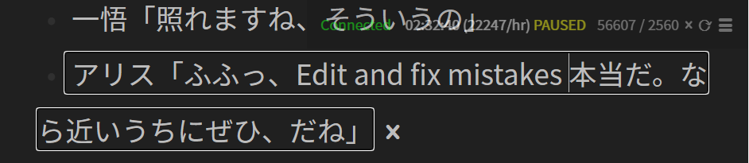

# Texthooker Websocket Userscript

A userscript intended for text inserting on the [Anacreon texthooking page](https://anacreondjt.gitlab.io/texthooker.html) (online and offline, if locally saved). It allows for use with the [Textractor Websocket](https://github.com/sadolit/textractor-websocket) plugin allowing for instantaneous text inserting due to the way sockets work. In contrast, a clipboard inserter extension is quite janky in having to check your clipboard many times a second, leading to delays in text appearing, issues with skipped text, polluting your clipboard, and making copying text annoying when activated.

## Usage

- Install the [Textractor Websocket](https://github.com/sadolit/textractor-websocket) plugin in Textractor
- [Install the userscript](https://github.com/MarvNC/texthooker-websocket/raw/master/texthooker.user.js) (I recommend using [Violentmonkey](https://violentmonkey.github.io/) to manage userscripts)
- Start your visual novel
- After there are lines present in Textractor, click "Reconnect" on the texthooking page if it is not connected
- Unpause the timer
- Lines will instantly appear on your texthooker page when they are extracted by Textractor

## Additional Features

- **Edit pasted text by double clicking**
- **Paste lines by CTRL + V'ing into the page**
- Do not allow lines to be added when timer is paused
- Hide timer and characters/hour speed while the timer is paused
- Easy copying of character count and time information for pasting to spreadsheets (by clicking on the character/line count)
- Flash screen if the timer is paused and new lines are inserted (to prevent you forgetting to unpause the timer)
- Auto pause the timer after 60 seconds AFK (can disable in the hamburger menu)
- Easily set/adjust the current timer (in the hamburger menu)
- Pause timer on page load
- Hide timer (toggle in the hamburger menu)
